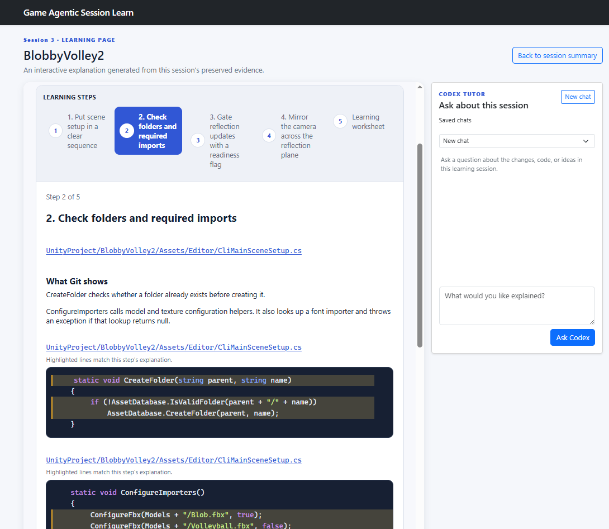
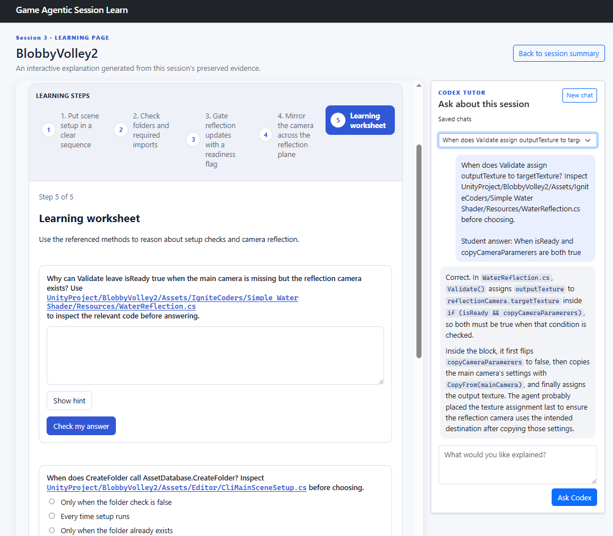

# Game Agentic Session Learn

GameLearn is a local learning tool for agentic coding in Unity projects. Its main purpose is to help students understand what a coding agent did after carrying out a prompt. While the agent works, GameLearn independently monitors the project's Git changes and builds a timeline. When the work is complete, the student can review the evidence and generate a beginner-friendly lesson explaining what changed, how the code works, and why the agent probably chose that approach.

GameLearn is intended to run on localhost on the student's own computer at `http://127.0.0.1:5000`, using the student's authenticated Codex account. No third-party server or paid web hosting is needed.

GameLearn does not edit, run, or commit the Unity project. Monitoring stays on the student's computer. Code evidence is sent to Codex only when the student creates a learning page or asks the tutor a question.

The project was created in the context of the [partnership between the Government of Malta and OpenAI](https://openai.com/index/malta-chatgpt-plus-partnership/). Through Malta's AI for All initiative, Maltese citizens who complete the programme's AI literacy course can receive one year of ChatGPT Plus at no cost. Because Codex is included with ChatGPT Plus, eligible students can use GameLearn with their own account, subject to their plan's usage limits.

## What you need

- Windows 10/11 or macOS 13+
- [Git](https://git-scm.com/downloads)
- [Node.js](https://nodejs.org/en/download)
- The [Codex CLI](https://learn.chatgpt.com/docs/codex/cli), signed in with `codex login`
- A Unity project inside a Git repository with at least one commit
- Internet access during the first launch

You do not need to install Python. The launcher installs a private Python 3.11 runtime and the required packages inside the GameLearn folder.

To check the required tools, open PowerShell on Windows or Terminal on macOS and run:

```text
git --version
node --version
codex --version
codex login status
```

Each command should report a version or a signed-in account. If Codex is not signed in, run `codex login` and follow the instructions.

## Download GameLearn

Download or clone this repository, then open a terminal in the folder containing `README.md` and the two launcher files. Do not run GameLearn from inside a ZIP preview, and keep its folder separate from the Unity project you want to monitor.

## Start GameLearn

### Windows

From PowerShell in the GameLearn folder, run:

```powershell
Set-ExecutionPolicy -Scope Process Bypass
.\start_gamelearn.ps1
```

### macOS

From Terminal in the GameLearn folder, run:

```bash
chmod +x start_gamelearn.sh
./start_gamelearn.sh
```

The first launch can take several minutes while GameLearn downloads its local Python runtime and dependencies. When the terminal shows that GameLearn is ready, open [http://127.0.0.1:5000](http://127.0.0.1:5000).

Keep the terminal open while using GameLearn. Press **Ctrl+C** in that terminal to stop the server.

For later launches, when `requirements.txt` has not changed, use:

```powershell
.\start_gamelearn.ps1 -SkipSync
```

or on macOS:

```bash
./start_gamelearn.sh --skip-sync
```

## Record a session

Before starting, the Unity repository must have at least one commit and no uncommitted changes. GameLearn will refuse to start with a dirty working tree; it never commits, stashes, resets, or discards student work.

1. Open GameLearn and paste the Unity project path or its Git repository path.
2. Select **Find and register project**. If the repository contains several Unity projects, use the exact Unity project folder.
3. Select **Start GameLearn session** before giving the coding agent its prompt.
4. Ask the coding agent to carry out the change. As it edits the project, saved Git changes appear in the GameLearn timeline.
5. Select **End session** after the agent has finished its work.
6. Review the timeline, changed files, and Git diff to see what the agent did.
7. Create a learning page to understand how the changes work and why the agent probably made them.

A valid Unity project contains `Assets`, `Packages`, and `ProjectSettings`. It may be nested inside the Git repository.

## Create a learning page

On a completed session's summary, select **Create learning page**. You may choose an available Codex model and reasoning level; tutor and worksheet requests use Low reasoning.

GameLearn creates a separate Codex task for each learning page or tutor request. Lessons focus on recorded Unity C# changes and clearly distinguish Git evidence from likely intent. Non-code files such as scenes, prefabs, assets, logs, and documentation are not sent as lesson content.

The generated guide includes:

- a step-by-step explanation of what changed and why;
- selected code blocks and diagrams where useful;
- focused follow-up questions with a saved tutor chat; and
- a short worksheet with feedback.

Learning pages, evidence, and chats are saved locally, so completed sessions can be reopened later.

### What the learning page looks like

The lesson presents the recorded code changes as clear learning steps, with the Codex tutor available alongside the explanation.



The final step includes a worksheet. Students can inspect the referenced code, submit an answer, and review feedback in the tutor chat.



## Troubleshooting

| Problem | Try this |
| --- | --- |
| The launcher cannot be found | Make sure the terminal is open in the folder containing `start_gamelearn.ps1` and `start_gamelearn.sh`. |
| PowerShell blocks the script | Run `Set-ExecutionPolicy -Scope Process Bypass` in the same PowerShell window, then retry. |
| Git, Node.js, or Codex is missing | Install the tool, open a new terminal, and repeat the version checks above. |
| Codex says sign-in is required | Run `codex login`, or try `codex login --device-auth`, then restart GameLearn. |
| The browser cannot connect | Keep the launcher terminal open, check it for errors, and use the exact address `http://127.0.0.1:5000`. |
| Port 5000 is already in use | Use the GameLearn server already running, or stop its earlier terminal with **Ctrl+C**. |
| First-time setup fails | Check the internet connection and run the launcher again without the skip option. |

If a problem continues, copy the full terminal error and share it with your teacher or maintainer.

## Privacy and safety

- GameLearn listens only on `127.0.0.1`, so it is not exposed to other computers.
- Session evidence and chat history are stored locally in `instance/gamelearn.db`.
- GameLearn sends bounded C# evidence to the authenticated local Codex CLI only after an explicit learning-page, tutor, or worksheet request.
- It does not store model credentials, call a model API directly, automate the Codex desktop app, or invoke Unity.
- Bootstrap styling is loaded from a public CDN. The app still works offline after setup but may appear unstyled.

## Development

Use the virtual environment created by the launcher.

Windows:

```powershell
.\.venv\Scripts\python.exe -m pytest -q
```

macOS:

```bash
./.venv/bin/python -m pytest -q
```

Before submitting a change, run the full test suite and `git diff --check`.
